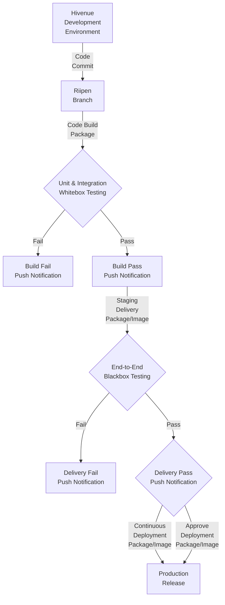

**Note:** This is a *Business Requirement Document* (**BRD**) which is a *Work in Progress* (**WIP**) and will serve as a *Service Level Agreement* (**SLA**) between ***Hivenue*** and ***BTC6*** (Beyond The Cloud Team #06).

#
### Hivenue `PoC`: CTO

### BTC6:
- **Alejandro Castellanos `PoC`** (He/His/Him)
- **Chima Annonye** (He/His/Him)
- **Haroon Khan `PoC`** (He/His/Him)
- **Jayme Liao** (She/Her)
- **Mingxia Zeng** (She/Her)

#
#### [Hivenue Riipen Pages - https://beyondthecloud.riipen.com/teams/QVdXDavV](https://beyondthecloud.riipen.com/teams/QVdXDavV)

# Hivenue CI/CD

`Version: 1.0.0`

`Project Kick-off: Tue 2024 Oct 15 | 60Hrs. per 6 Weeks`

## Requirement:
Hivenue need to integrate ***Development Environment*** with a ***CI/CD Pipeline*** to *automate* production deployment.

### CI/CD Pipeline Workflow
1. **Build** (Packaging with Dependencies)
2. **Unit/Integration Testing** (Whitebox Testing)
3. **Staging** (Continues Delivery - Package/Image)
4. **End-to-End Testing** (Blackbox Testing/UAT)
5. **Production** (Continuous Deployment - Package/Image)
6. **Push Notifications** (At each step)

### CI/CD Pipeline Flowchart

### CI/CD Pipeline Milestones
- **NDA** Signing-off
- **Github** *Riipen branch* Creation and Access
- **BRD** Approval
- **Code Commit** *Event* to Riipen branch
- **Github Workflow (IaC)** *Trigger*
    - **Continuous Integration**
        1. **Code Build**
        2. **Unit/Integration** (Whitebox) Testing
        3. **Push Notification** (Build Pass/Fail)
    - **Continuous Delivery**
        1. **Staging** (AWS Hivenue Workload Deployment)
        2. **End-to-End** (Blackbox) Testing
        3. **Push Noification** (Delivery Pass/Fail)
    - **Continuous Deployment**
        1. **Production** (Automate AWS Deployment)
        2. **Production** (Awaiting Approval AWS DEployment)
        3. **Push Notification** (Deployment Success/Awaiting Approval)

### Hivenue Deliverables
1. **NDA** Document
2. **BRD** Feeback and Approval
3. **Performance Metrics**
    - **MTTD** Mean Time to Detect
    - **MTTR** Mean Time to Repair (Time to Market/Production)
    - **MTBF** Mean Time between Failures
    - **Downtime**
    - **Uptime**
    - **TCO** Total Cost of Ownership (Manual Testing/Deployment)
4. **Github** Riipen Branch Access
5. **Unit/Integration** Test Codebase 
    - Preffered Unit Testing Framework
6. **Github** Push Notification Access (PoC's)
7. **Package vs Image** (Preferred Deployment Artifact)
8. **AWS IaC** Staging Access
9. **End-to-End** Test Case Documentation
    - Preffered Test Automation Framework (e.g. Selenium, Cucumber)
10. **AWS IaC** Production Access

### BTC6 Deliverables
1. **CI/CD IaC** (Infrastructure as Code)
2. **CI/CD IaC Documentation**
3. **Unit/Integration Testing Framework**
4. **Unit/Integration Testing Documentation**
5. **End-to-End Testing Framework**
6. **End-to-End Testing Documentation**
7. **Performance Improvement**