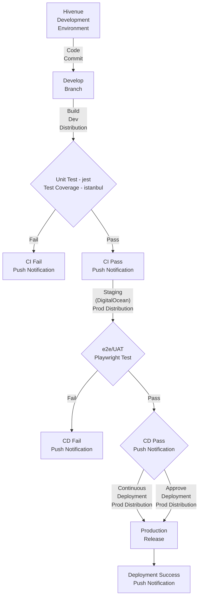

**Note:** This is a *Business Requirement Document* (**BRD**) and is *Ready for Review* and will serve as a *Service Level Agreement* (**SLA**) between ***Hivenue*** and ***BTC6*** (ICTC Beyond The Cloud Team #06).

___
# Hivenue CI/CD Pipeline

**[Riipen Pages - https://beyondthecloud.riipen.com/teams/QVdXDavV](https://beyondthecloud.riipen.com/teams/QVdXDavV)**

`Version: 1.1.1`

`Project Kick-off: 2024 Oct 15 Tue | 60Hrs. per 6 Weeks`

`Project Sign-off: 2024 Nov 25 Mon`

| Hivenue                       | BTC6                  |
|-------------------------------|-----------------------|
| Nassim Bahloul `CEO`          | Alejandro Castellanos |
| Louenas Hamdi `CTO`           | Jayme Liao            |
| Hanson Liang `Lead Developer` | Haroon Khan           |

## Requirement:
Hivenue need to integrate ***Development Environment*** with a ***CI/CD Pipeline*** to *automate* stage delivery.

### CI/CD Pipeline Workflow
1. **CI** (Continuous Integration)
    - Quality Check Project 
    - Build Dev Distribution
        - Unit Testing (jest)
        - Test Coverage (istanbul)
    - Slack/Discord Notification with Reports

2. **CD** (Continuous Delivery)
    - Build Prod Distribution
    - Stage Deployment
        - Stage Configuration
        - Stage Start
    - Slack/Discord Notification with Reports

3. **e2e/UI Testing** (playwright)
    - e2e Test based on `prod` `dev` `devops` and `github` (url)
    - Slack/Discord Notification with Reports

### CI/CD Pipeline Flowchart

### CI/CD Pipeline Milestones
- **BRD** Review, Feedback, Meeting and Approval
- **NDA** Signing-off (Hivenue discretion)
- **Github** *Riipen Repo* Creation and Access
- **Code Commit** *Workflow Run* on Riipen repo
- **Github Workflow** *Trigger* (Github Workflow permission)
    - **Continuous Integration**
        1. **Code Build** (Hivenue Github Action)
        2. **Unit/Integration** (Whitebox) Testing (jest/istanbul)
        3. **Push Notification** (Build Pass/Fail) (PoC's)
    - **Continuous Delivery**
        1. **Staging** (Hivenue DigitalOcean Stage Server Access)
        2. **End-to-End** (Blackbox) Testing (Playwright)
        3. **Push Noification** (Delivery Pass/Fail)
    - **Continuous Deployment**
        1. **Production** (Automate DigitalOcean Deployment)
        2. **Production** (Awaiting Approval DigitalOcean DEployment)
        3. **Push Notification** (Deployment Success/Awaiting Approval)

### Hivenue Deliverables
1. **BRD** Review, Feeback and Approval
2. **NDA** Document (Hivenue discretion)
3. **Performance Metrics** (Hivenue discretion)
    - **MTTD** Mean Time to Detect
    - **MTTR** Mean Time to Repair (Time to Market/Production)
    - **MTBF** Mean Time between Failures
    - **Downtime**
    - **Uptime**
    - **TCO** Total Cost of Ownership (Manual Testing/Deployment)
4. **Github** Riipen Repo Access
5. **Unit/Integration** Test Codebase
6. **Github** Push Notification Access (PoC's) e.g. Slack
7. **Distribution** (Preferred Deployment Artifact)
8. **DigitalOcean** Server Access
9. **End-to-End** e2e Playwright Project
10. **DigitalOcean IaC** Production Access

### BTC6 Deliverables
1. **BRD**
2. **CI/CD**
    - CI Workflow
    - CD Workflow
    - e2e Workflow
2. **CI/CD Artifacts**
3. **CI/CD Documentation**
3. **Unit/Integration Testing Framework**
5. **e2e Testing Project**
6. **End-to-End Testing Documentation**
7. **Performance Improvement**