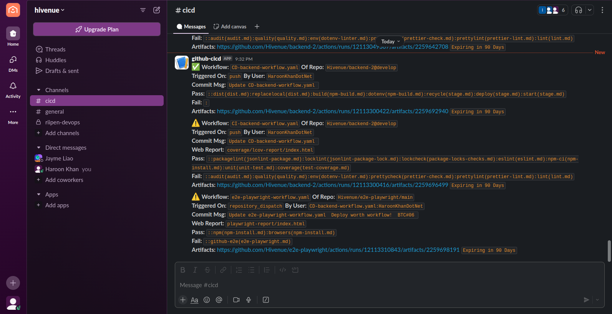
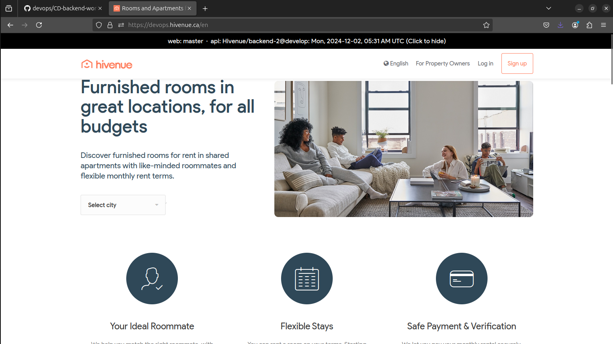
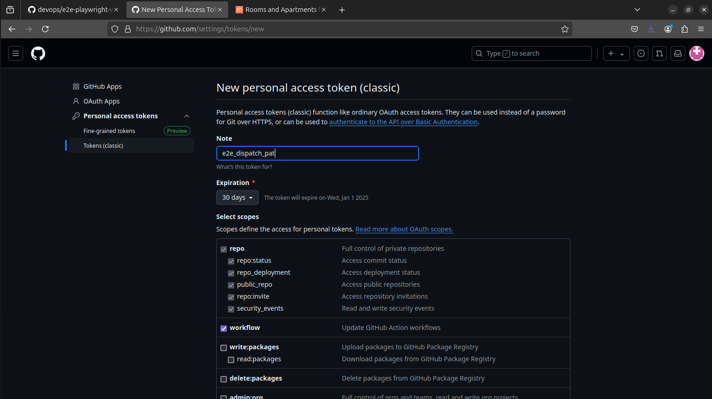

**Note:** This is a *ReadMe Document* and is *Ready to Review* and will serve as a *Service Level Agreement* (**SLA**) between ***Hivenue*** and ***BTC6*** (ICTC Beyond The Cloud Team #06).
___
# Hivenue CI/CD Pipeline
**[Riipen Pages - https://beyondthecloud.riipen.com/teams/QVdXDavV](https://beyondthecloud.riipen.com/teams/QVdXDavV)**

`Version: 1.0.0`

`Project Kick-off: 2024 Oct 15 Tue | 60Hrs. per 6 Weeks`

`Project Sign-off: 2024 Nov 25 Mon`

| Hivenue                       | BTC6                  |
|-------------------------------|-----------------------|
| Nassim Bahloul `CEO`          | Alejandro Castellanos |
| Louenas Hamdi `CTO`           | Jayme Liao            |
| Hanson Liang `Lead Developer` | Haroon Khan           |

## Requirement:
Hivenue need to integrate ***Development Environment*** with a ***CI/CD Pipeline*** to *automate* stage delivery.


### CI/CD Pipeline Technical Overview
1. **CI** (Code Integration)
  - Audit Dependencies
  - Unused Dependency
  - Quality & Sanity Check
  - dotenv-linter
  - package-locks-checks
  - jsonLint `package.json` & `package-lock.json`
  - esLint Project
  - lint Project
  - prettier Styling
  - Building Dev Project
      - Unit Testing (jest)
      - Test Coverage (istanbul)
  - Slack/Discord Notification with Reports
2. **CD** (Code Delivery)
  - Building Dist
  - Building Prod Project
  - Stage Deployment
  - Stage Configuration
  - Stage Start
  - Slack/Discord Notification with Reports
3. **e2e/UI Testing** (playwright)
  - e2e Test based on `prod` `dev` `devops` and `github` (url)
  - Slack/Discord Notification with Reports

### CI/CD Pipeline Technical Details
**Note:** Due to time limitations only backend CI/CD is delivered

**Deliverables**
  - CD/CD Artifacts
    - `CI-backend-workflow.yaml` To run Backend CI Workflow
    - `CD-backend-workflow.yaml` To run Backend CD Workflow
    - `e2e-playwright-workflow.yaml` To run e2e Playwright Workflow
    - `package.json` Containing test:coverage script and renewed lint script
    - `BRD.md` Business Requirement Document
    - `README.md`
  - e2e Playwright Project https://github.com/HaroonKhanDotNet/hivenue-cicd/tree/main/e2e-playwright
  - nginx configuration file https://github.com/HaroonKhanDotNet/hivenue-cicd/tree/main/webserver-loadbalancer

### `package.json`
    ```js
      "scripts": {
        "lint": "eslint .",
        "test:coverage": "jest --coverage --detectOpenHandles --verbose --forceExit"
      }
    ```

### CI Workflow

1. **Secrets** (To be kept at Organization Level)
    - `TEST_MONGO_USER` ***
    - `TEST_MONGO_PW` ***
    - `TEST_MONGO_DB` ***

2. **Event Triggers**
  - `workflow_dispatch` to trigger workflow manually
  - `push` to trigger workflow when new commit is pushed including after a merge
  - `pull_request` to trigger workflow when
    - `opened` a new PR is created
    - `synchronize` commits are added, updated or deleted from opened PR
    - `reopned` a PR is reopened

  **Note:** In case of PR event, github simulate merge commit on target branch and provide `mergeable` (true/false) flag. In case of `false` the workflow quit, since there is no point to continue when there are merge-conflicts in the current codebase.

3. **Matrix Strategy**
  - The matrix strategy is kept in the beginning of a job and used to simulate the project using various operating systems `matrix.os` (ubuntu, windows, macos), `matrix.nodejs` (18.12.0, 18.x, 20.x, 22.x) and `matrix.mongodb` (6.0, 7.0, 8.0). It is to be kept in the beginning of the workflow script as it gets processed very first.

  - If we uncomment the remaining os, nodejs and mongodb then this construct run the application codebase with all the combinations and return results accordingly.

  - Note: For keeping things under control and maintaining a compliance baseline, only `ubuntu-nodejs18.12.0-mongodb6.0` combination is used for the `runner` (github vm).

  - For more information: [Matrix Strategy](https://docs.github.com/en/actions/writing-workflows/choosing-what-your-workflow-does/running-variations-of-jobs-in-a-workflow)

    ```js
    strategy:
      matrix:
        os: 
          - ubuntu-latest
          # - windows-latest
          # - macos-latest
        nodejs:
          - ***
          # - 18.x
          # - 20.x
          # - 22.x
        mongodb:
          - 6.0
          # - 7.0
          # - 8.0
    ```

4. **Background Service**
  - DockerHub Image `mongo:6.0` is used to run as 'background service' in the runner right after the 'matrix strategy'. Here some of the 'organization secrets' are used to get `user`, `pw` and `db`.

    ```js
    services:
      mongo:
        image: mongo:${{ matrix.mongodb }}
        env:
          MONGO_INITDB_ROOT_USERNAME: ${{ secrets.TEST_MONGO_USER }}
          MONGO_INITDB_ROOT_PASSWORD: ${{ secrets.TEST_MONGO_PW }}
          MONGO_INITDB_DATABASE: ${{ secrets.TEST_MONGO_DB }}
        ports: 
          - '27017:27017'
    ```

5. **Connection String** (MondoDB)
  - This connection string is used in 'unit test'. Ideally this connection string should be placed either on `secrets.MONGO_CONNECTION_STRING` or construct the string within the unit_test project using `secrets.TEST_MONGO_USER`, `secrets.TEST_MONGO_PW` and `secrets.TEST_MONGO_DB`.

    ```js
    MONGOLAB_URI: mongodb://${{ secrets.TEST_MONGO_USER }}:${{ secrets.TEST_MONGO_PW }}@localhost:27017/${{ secrets.TEST_MONGO_DB }}?authSource=admin
    ```

6. **Workflow Steps**
  - This will checkout the code from current repo/branch where the workflow reside.
    ```js
    - name: Checkout Code
        uses: actions/checkout@v4
    ```

  - **SNYK SAST (Static Application Security Test) Backend Results**
  
    SNYK free account only allows limited testing through their console. Also, in free account we cannot create the token to run from Github.
    [https://snyk.io/](https://snyk.io/)


  - This will setup node based on `matrix.nodejs` version
    ```js
    - name: Setup NodeJS
        uses: actions/setup-node@v4
        with:
          node-version: ${{ matrix.nodejs }}
    ```

  - Cache is commented out for now. npx quality cannot run properly
  
      ```js
      # This will get the default npm cache path from `runner`
      - name: Get npm Cache Path
        id: npm-cache-path   # use this to get npm cache folder ${{ steps.npm-cache-dir.outputs.dir }}
        shell: bash  # to make sure we are not using dash shell
        run: echo "cache_dir=$(npm config get cache)" >> $GITHUB_ENV

      # Note: It is not recommended to cache node_modules, as it can break across Node versions and won't work with npm ci
      - name: Setup npm-dependencies Cache
        uses: actions/cache@v4
        id: npm-cache   # use this to check for `cache-hit` ==> if: steps.npm-cache.outputs.cache-hit != 'true'
        with:
          path: ${{ env.cache_dir }}
          key: ${{ runner.os }}-hivenue-backend-npm-build-${{ github.ref_name }}-${{ hashFiles('**/package-lock.json') }}
      ```

  - This will install all npm dependencies i.e. production and dev, so that unit test and later e2e test can be run on the codebase. Also, this will generate npm-install.md file everytime to have an extra check.  
  **Note:** The `if` condition is commented to check for a cache presence in order to avoid npm quality/sanitycheck issue.
    ```js
    - name: clean-install node Dependencies
        # Following line is commented out to npm install everytime and generate npm-install.md. If we uncomment the line below we can use cache and skip npm install
        # if: steps.npm-cache.outputs.cache-hit != 'true'  # Check to see if npm cache is already available or not
        run: |
          set -e
          
          npm ci --verbose 2>&1 | tee -a npm-install.txt
          exit_code=${PIPESTATUS[0]}
          install_msg='npm-ci(npm-install.md)'

          if [ $exit_code -ne 0 ]; then
            echo '`FAIL`' > npm-install.md
            echo "notify_sign=':x:'" >> $GITHUB_ENV
            echo "notify_fail=$notify_fail:$install_msg" >> $GITHUB_ENV
          else
            echo '`PASS`' > npm-install.md
            echo "notify_pass=$notify_pass:$install_msg" >> $GITHUB_ENV
          fi

          echo "$install_msg" >> npm-install.md
          echo '```js' >> npm-install.md
          cat npm-install.txt >> npm-install.md
          echo '```' >> npm-install.md
          
          echo $install_msg  # Output the audit status for debugging
          exit $exit_code  # Exit with the same exit code as npm audit

          set +e
    ```

7. **Test Coverage**
    - **package.json** This step also generate web report `coverage/lcov-report/index.html` 

    `"scripts": { "test:coverage": "jest --coverage --detectOpenHandles --verbose --forceExit" }`
    ```js
      - name: test coverage (istanbul)
        run: npm run test:coverage
    ``` 
    **Note:** Every step in the workflow has the same set of shell script as above. The script sorrounding `npm ci` is all about capturing exit code, decide if it fail/pass and construct slack/discord notification with .md report to make available at the end of the workflow.

8. **Export: Report Artifacts**
    ```js
      - name: upload .md reports
        id: CI_backend_reports
        continue-on-error: true
        if: always()
        uses: actions/upload-artifact@v4
        with:
          name: CI backend reports
          path: |  # Required - A file, directory or wildcard pattern that describes what to upload
            npm-install.md
            audit.md
            dotenv-linter.md
            jsonlint-package.md
            jsonlint-package-lock.md
            package-locks-checks.md
            quality.md
            eslint.md
            prettier-check.md
            lint.md
            prettier-lint.md
            unit-test.md
            test-coverage.md
            coverage
            
          overwrite: true
          include-hidden-files: true
    ```

9. **Slack Notification**

    - Workflow: Name of Workflow
    - Of Repo: Owner/Repository@Branch
    - Triggered On:
      - repository_dispatch: CD trigger e2e
      - workflow_dispatch: manual trigger
      - push: new commit and after merge
      - pull_request: PR created, sync and reopened
    - By User: This could be in the form Workflow/Actor, as user might be another workflow triggering this workflow
    - Commit Msg. Latest commit message with extended multiline comment.
    - Web Report: This could be test coverage and e2e playwright website folder.
    - Pass/Fail: Contain the reports of all pass and fail steps
    - Artifacts: URL to download the folder containing all reports and possibly website to view reports in .md format. The URL expire in 90 days by default. We can change it from upload artifacts step.

### CD Workflow

  1. **Secrets** (To be kept at Organization Level):
      - `STAGE_HOST` ***
      - `STAGE_USER` ***
      - `STAGE_PASSWORD` ***
      - `E2E_DISPATCH_PAT` ***

  2. **Event Trigger** and **Matrix Strategy** same as CI workflow

  3. **PR Mergeable Check** same as CI workflow

  4. **build dist/**
      - Create a folder dist/ and copy selected files and folders for production build.
      ```js
          mkdir -p dist
          rsync -av  \
          --exclude='.*'  \
          --exclude=README.md  \
          --exclude=docker-compose.yml  \
          --exclude=jest.config.js  \
          --exclude='migrate-mongo-config.js'  \
          --exclude=migrations/  \
          --exclude=tests/  \
          . dist/
      ```

  5. **replace 'local'**
      - Get the current datetime and replace local with repo@branch: datetime.
      ```js
          # get the current day, date:time and timzezone
          dtm=$(date "+%a, %Y-%m-%d, %I:%M %p %Z")

          # enable shell-option globstar which allow recursive file matching with ** wildcard
          shopt -s globstar

          # Replace all occurences of 'local' with 'riipen' recursively in all subdirectories **routes/system.js and **utils/log.js
          sed -i "s|local|${{ github.repository }}@${{ github.ref_name }}: $dtm|g" dist/**/*routes*/system.js dist/**/*utils*/log.js
      ```
      

  6. **`npm ci --omit=dev --ignore-scripts`**
      - **Note:** npm ci try to run husky script which is not needed in production.
      
  7. **`npm install dotenv`**
      - **Note:** dotenv need to move to production dependency. Currently it is in devDependency.

  8. **stage prep**
      
      Deleting and Create remote folder `api` 
      - `sshpass -p "$REMOTE_PASSWORD" ssh -o StrictHostKeyChecking=no "$REMOTE_USER@$REMOTE_HOST" 'rm -rf /srv/***/api && mkdir -p /srv/***/api'`

  9. **stage deploy**
      - `sshpass -p "$REMOTE_PASSWORD" rsync -avz --delete -e 'ssh -o StrictHostKeyChecking=no' dist/ "$REMOTE_USER@$REMOTE_HOST:/srv/***/api"`

  10. **stage start**
      - copy .env file into stage api/
      - make ssh-user owner of stage api/
        ```js
          sshpass -p "$REMOTE_PASSWORD" ssh -o StrictHostKeyChecking=no "$REMOTE_USER@$REMOTE_HOST" "
              cd /srv/wemoove/api &&
              cp /srv/wemoove/environments/backend/.env . &&
              chown $REMOTE_USER -R . &&
              systemctl restart hivenue-devapi
            "
        ```
      - restart `hivenue-devapi`
        - this will call `start_api.sh`
        ```js
          #!/bin/bash
          export PATH="/root/.nvm/versions/node/v18.***/bin:/usr/local/sbin:/usr/local/bin:/usr/sbin:/usr/bin:/sbin:/bin:/usr/games:/usr/local/games:/snap/bin"
          npm start
        ```

  11. **calling e2e-playwright workflow**
      
      **Note:** To be kept in secrets at organization level.
      `secrets.E2E_DISPATCH_PAT: ***`
      
      - This step is calling the github api webhook `dispatches` with `event-type` to trigger the workflow attached to it.
      - `client_payload` contain `e2e-url` to be sent to dispatching workflow. 

      ```js
        - name: trigger e2e-playwright-workflow.yaml (hivenue/e2e-playwright)
        env:
          e2e_pat: ***
        run: |                   
          curl -L \
              -X POST https://api.github.com/repos/hivenue/e2e-playwright/dispatches \
              -H "Accept: application/vnd.github+json" \
              -H "Authorization: Bearer ${{ env.e2e_pat }}" \
              -H "Content-Type: application/json" \
              -H "X-GitHub-Api-Version: 2022-11-28" \
              -d '{"event_type":"CD-backend-workflow.yaml","client_payload":{"e2e-url": "https://hivenue.ca/"}}'
      ```

### e2e Playwright

  1. **repository_dispatch Trigger**

      **Note:** A `token` and `types` to target the specific workflow

      

      ```js
      on:
        repository_dispatch:  # callable by github api with permission token 
          types:
            - CD-backend-workflow.yaml  # CD-backend-workflow can call this workflow with permission token
      ``` 

  2.  **Conditional Steps**
      
      **Note:** Some steps are repo specific and could only be triggered in case of `workflow_dispatch` `push` and `pull_request` and skipping in case of `repository_dispatch`
      ```js
      - name: audit project
        continue-on-error: true
        run: |
          if [ "${{ github.event_name }}" != "repository_dispatch" ]; then
            set -e
            
            npm audit 2>&1 | tee audit.txt
            exit_code=${PIPESTATUS[0]}
            audit_msg='audit(audit.md)'

            if [ $exit_code -ne 0 ]; then
              echo '`FAIL`' >> audit.md
              echo "notify_sign=':warning:'" >> $GITHUB_ENV
              echo "notify_fail=$notify_fail:$audit_msg" >> $GITHUB_ENV  
            else
              echo '`PASS`' >> audit.md
              echo "notify_pass=$notify_pass:$audit_msg" >> $GITHUB_ENV
            fi
          
            echo "$audit_msg" >> audit.md
            echo '```js' >> audit.md
            cat audit.txt >> audit.md
            echo '```' >> audit.md

            echo $exit_code:$audit_msg
            exit $exit_code
          
            set +e
          fi
      ```

  3. **e2e playwright**
  
      ```js
        - name: run e2e tests
        continue-on-error: true
        env:
          E2E_GITHUB_URL: ${{ github.event.client_payload.e2e-url }}
          
        # run: npm run test:github  # this will take the env url
        # run: npm run test:prod  # this will e2e https://hivenue.ca/
        # run: npm run test:dev  # this will e2e https://***.hivenue.ca/
        # run: npm run test:devops  # this will e2e https://***.hivenue.ca/
        run: |
          set -e
          
          if [ -z ${{ env.E2E_GITHUB_URL }} ]; then
            env='prod'
          else
            env='github'
          fi

          npm run test:"$env" 2>&1 | tee e2e-playwright.txt
          exit_code=${PIPESTATUS[0]}
          e2e_msg="$env-e2e(e2e-playwright.md)"
      ``` 

      - Getting `${{ github.event.client_payload.e2e-url }}` from the payload received.
      - This step also generate web report `playwright-report/index.html`.
      - If there is no url then `test:prod` is called.
  
      **Note:** Every step in the workflow has the same set of shell script as above. The script sorrounding `npm ci` is all about capturing exit code, decide if it fail/pass and construct slack/discord notification with .md report to make available at the end of the workflow.